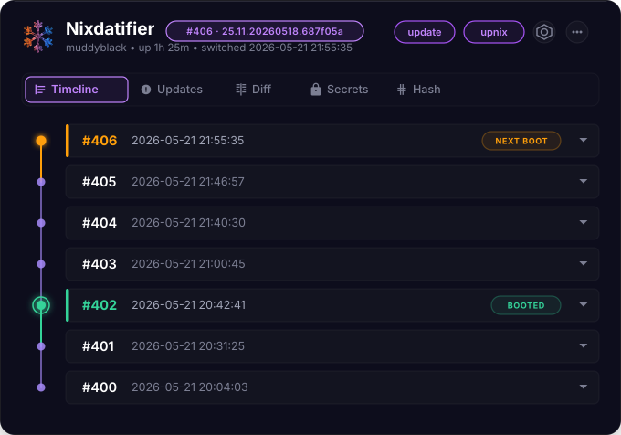
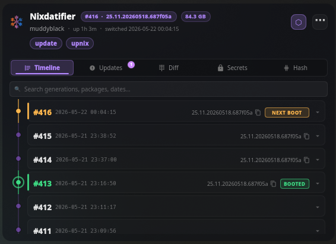
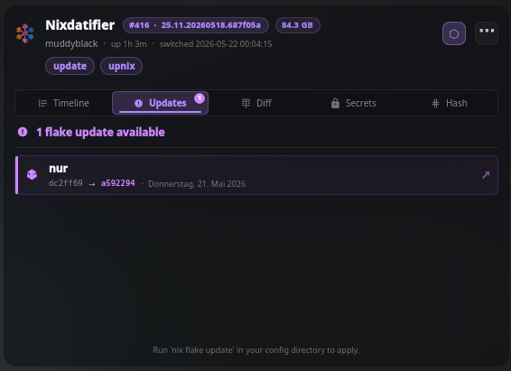
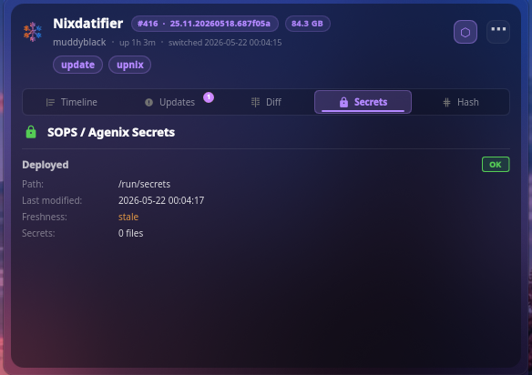
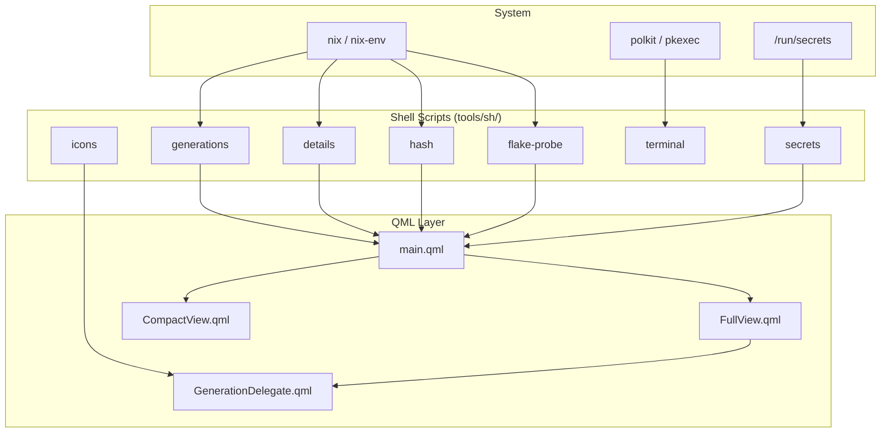

<p align="center">
  
</p>

<h1 align="center">Nixdatifier</h1>

<p align="center">
  <a href="https://store.kde.org/p/2360222/">
    
  </a>
  
  
  <a href="https://opensource.org/licenses/MIT">
    
  </a>
  <a href="https://store.kde.org/p/2360222/">
    
  </a>
  <a href="https://github.com/Muddyblack/kde-nixdatifier/releases">
    
  </a>
</p>

<p align="center">
  
</p>

A KDE Plasma 6 widget for NixOS to view system generations, package diffs, flake updates, and active secrets directly from the panel.

<p align="center">
  
</p>

<p align="center">
  
</p>

<p align="center">
  
</p>

---

## Shared UI for Plasma and Hyprland

The redesign uses one QML application for both desktops: Generations, Updates,
Compare, and Tools. It retains the original flake artwork, animated generation
rail, expandable package changes, full settings, and existing generation actions.
Work status uses the existing footer and its animated bottom edge. Action feedback
stays in a small footer indicator with details on click, without covering controls.

- **Plasma:** the existing plugin ID and settings remain compatible. Preview with
  `make view`; the default flake package still installs the plasmoid.
- **Hyprland:** run `nix run path:.#hyprland` from this checkout. The new package
  includes the Quickshell popup, configurable edge pill, and standard tray entry.
  Add the installed `nixdatifier-hyprland` executable to Hyprland's `exec-once`.
- **Checks:** `make test` runs isolated QML and helper tests. It does not switch
  generations, update your flake, or collect garbage.

See [the implementation notes](docs/REDESIGN.md) for settings locations, IPC,
shared caches, development commands, and validation limits. The reviewed
[design brief](UI-REWRITE-PLAN.md) and HTML preview remain available.


## Features

- **Timeline** — Active, historical, and next-boot system generations.
- **Package Diff** — Lists package additions, upgrades, and removals between generations using `nix store diff-closures`.
- **Rollback & Boot Control** — Switch generations, set next-boot target, or delete generations (uses Polkit/`pkexec`).
- **Flake Updates** — Track pending package updates from upstream nixpkgs.
- **Custom Commands** — Keep up to 4 terminal commands (e.g., `nixos-rebuild`) in the footer Commands panel.
- **Secrets Viewer** — Inspect active age(nix) or sops-nix secrets and decryption paths.
- **Customization** — Change layout, background blur, opacity, colors, and fonts.

---

## How it works

The widget uses a QML frontend that queries helper shell scripts via `PlasmaCore.DataSource` to retrieve and format system state.



### Idle cost

The widget is built to do as close to nothing as possible while you are not
looking at it:

- **Nothing expensive runs on a background timer.** `du -sb /nix/store` and
  `nix-collect-garbage --dry-run` back the disk chips, and both walk the whole
  store, so they run only when the popup is open — rate-limited to once every
  30 minutes, never overlapping, and at `nice -n 19` / idle I/O priority.
- **Looping animations stop when the popup closes.** The pulsing "booted"
  marker and every spinner are bound to whether the popup is actually on
  screen, so a closed popup does not keep the render loop awake.
- **The flake cache watch cannot spin.** Cross-instance sync blocks on
  `inotifywait`; if it is missing or unusable the widget falls back to a slow
  poll instead of respawning the watch in a tight loop.
- **Package homepage lookups are bounded.** The `/nix/store` fallback scan is a
  single pass shared by every unresolved package, and is skipped entirely for
  large diffs.

While closed, a configured widget does one `flake-probe` per **Check Interval**
(default hourly, shared between instances via a cache file) and one cheap
`sysinfo` read every 30 minutes. That is all.

---

## Requirements

### Runtime

| Dependency | Purpose |
|---|---|
| `nix` | `nix store diff-closures`, `nix flake update --dry-run` |
| `nix-env` | `nix-env --list-generations` |
| `pkexec` (polkit) | Privilege escalation for generation actions |
| KDE Plasma ≥ 6.0 | Widget host environment |
| Qt 6 / QML | Rendering engine |

### Build and Development

| Dependency | Purpose |
|---|---|
| `nix` with flakes | Development shell and package build |
| `qt6.qtdeclarative` | `qmllint` and `qmlformat` |
| `kdePackages.kpackage` | `kpackagetool6` for local install |
| `pre-commit` | QML lint and format hooks |
| `zip` | Archive creation for distribution |

---

## Install

### Manual install (any distro)

```bash
git clone https://github.com/Muddyblack/kde-nixdatifier.git
cd kde-nixdatifier
kpackagetool6 -t Plasma/Applet -i package
# or, to update an existing install:
kpackagetool6 -t Plasma/Applet -u package
```

Then add the widget from Plasma's "Add Widgets" panel.

To remove: `kpackagetool6 -t Plasma/Applet -r org.muddyblack.nixosGenerationExplorer`

### NixOS (flake)

```nix
# flake.nix
{
  inputs.nixdatifier.url = "github:Muddyblack/kde-nixdatifier";

  outputs = { self, nixpkgs, nixdatifier, ... }: {
    nixosConfigurations.mybox = nixpkgs.lib.nixosSystem {
      modules = [
        ({ pkgs, ... }: {
          environment.systemPackages = [
            nixdatifier.packages.${pkgs.system}.default
          ];
        })
      ];
    };
  }
}
```

### Packaging for distribution

```bash
./pack.sh
# produces nixos-generation-explorer-<version>.plasmoid
```

---

## Configuration

All settings are available via the widget's right-click → Configure menu:

| Setting | Type | Default | Description |
|---|---|---|---|
| **Flake Path** | String | `""` | Path to your NixOS flake configuration directory |
| **Check Interval** | Integer | `3600` | Polling interval in seconds to probe flake updates |
| **Max Generations** | Integer | `10` | Max generations to display in the timeline |
| **Default View** | String | `"timeline"` | Active tab on startup (`timeline` / `updates` / `secrets` / `diff` / `hash`) |
| **Custom Commands** | String | *See below* | JSON array representing pinned terminal command actions (max 4) |
| **Show Command Buttons** | Boolean | `true` | Toggle the footer Commands panel |
| **Command Terminal** | String | `""` | Custom terminal emulator command wrapper (autodetects if empty) |
| **Use Pkexec** | Boolean | `true` | Elevate generation switch/delete privileges using Polkit |
| **Confirm Before Rollback** | Boolean | `true` | Display a verification popup dialog before activating a generation |
| **Confirm Before Delete** | Boolean | `true` | Display a verification popup dialog before deleting a generation |
| **Show Delete Button** | Boolean | `true` | Show trash icon to delete generations from system history |
| **Show Notifications** | Boolean | `true` | Push desktop notification alerts when upstream flake updates are detected |
| **Secrets Path** | String | `""` | Deployed secrets directory (defaults to `/run/secrets`) |
| **Secrets Source Path** | String | `""` | Path to encrypted secrets source config (sops-nix/agenix) |
| **Timeline Color** | Color | `#71849b` | Custom line and connector point hex color for the history list |
| **Accent Color** | Color | `#91bcff` | Focus and highlight elements styling color |
| **Background Card** | Boolean | `true` | Draw the configurable translucent card; disable to use the Plasma theme background |
| **Background Color** | String | `#f5131923` | Card color in `#AARRGGBB` format; the first pair sets opacity (e.g. `#80131923` for half opacity) |
| **Background Radius** | Double | `14.0` | Rounded corner styling radius size for the container card |
| **Custom Text Color** | Color | `#ffffff` | Overrides the system font color with a specific style hex |
| **Enable Glow** | Boolean | `true` | Toggle timeline marker glow |
| **Enable Motion** | Boolean | `true` | Animate the flake, footer loading edge, and green-to-amber timeline marker |
| **Icon Style** | String | `"colored"` | System icon representation mode (`colored` / `white` / `black` / `accent`) |
| **Diff View Mode** | String | `"compact"` | Output styling for Nix diffs (`compact` / `detailed`) |
| **Show Package Icons** | Boolean | `true` | Query and display app icons in diff closure lists |
| **Compact Style** | String | `"icon"` | Panel applet representation design (`icon` / `number` / `both` / `pill`) |

### Custom Commands JSON Schema

The `customCommands` option accepts a JSON array:

```json
[
  { "label": "update", "cmd": "nix flake update", "color": "accent" },
  { "label": "upnix",  "cmd": "upnix",            "color": "green"  }
]
```

Accepted `color` keys: `accent`, `green`, `red`, `default`. Maximum 4 entries.
