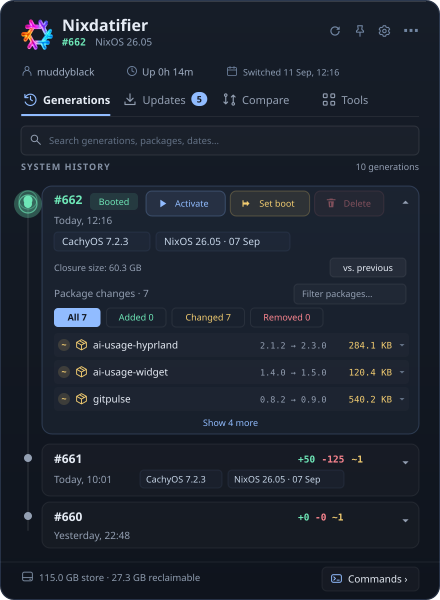
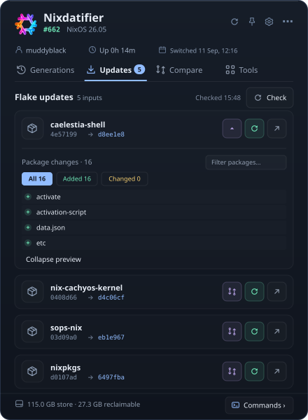
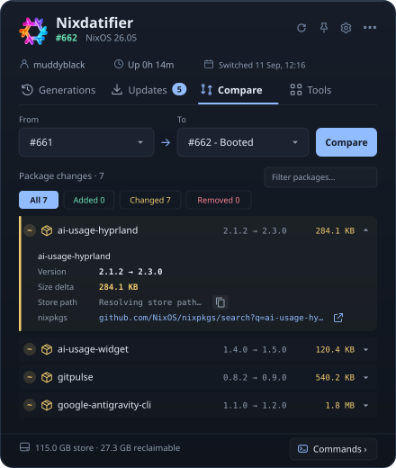
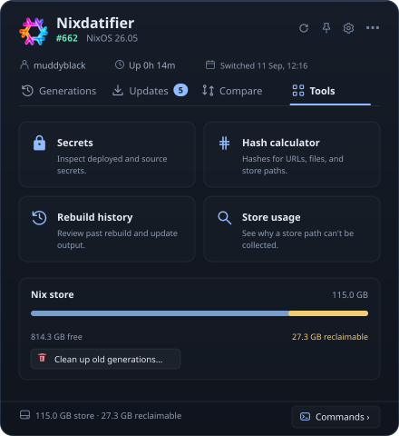
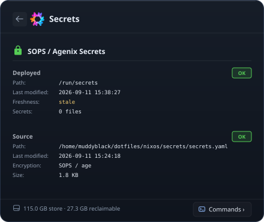
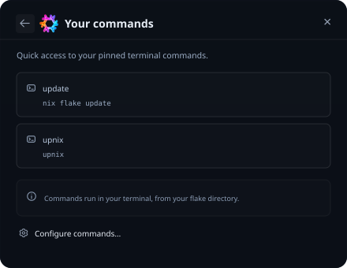
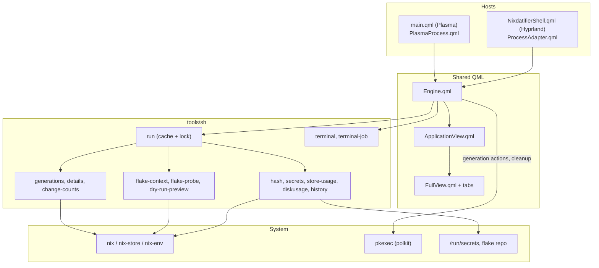

<p align="center">
  
</p>

<h1 align="center">Nixdatifier</h1>

<p align="center">
  <a href="https://store.kde.org/p/2360222/">
    
  </a>
  
  
  <a href="https://opensource.org/licenses/MIT">
    
  </a>
  <a href="https://store.kde.org/p/2360222/">
    
  </a>
  <a href="https://github.com/Muddyblack/kde-nixdatifier/releases">
    
  </a>
</p>

<p align="center">
  
</p>

<p align="center">
  A KDE Plasma 6 widget and Hyprland / Quickshell panel for NixOS: system generations, package diffs, flake updates, secrets, and Nix store usage, right from your panel.
</p>

## A closer look

| Generations timeline | Flake updates |
| --- | --- |
|  |  |
| Booted and next-boot generations on one rail, with per-generation package counts and inline actions. | Pending upstream inputs, revision changes, and package previews before you update. |

| Compare generations | Tools & Nix store |
| --- | --- |
|  |  |
| Package additions, removals, and upgrades between any two generations. | Store size, reclaimable space, cleanup, and the built-in tools. |

| Secrets inspector | Custom commands |
| --- | --- |
|  |  |
| Deployed and encrypted source secrets for sops-nix and agenix. | Your own terminal commands, run from the flake directory. |

---

## Features

- **Generations** — A timeline of your system generations with the booted and next-boot ones highlighted, added / removed / changed package counts, kernel and NixOS release badges, and search across numbers, dates, and package names.
- **Generation actions** — Activate a generation now, set it for next boot, or delete it (through Polkit/`pkexec`). The booted and next-boot generations are protected, and confirmations are configurable.
- **Package changes** — Expand any generation to see what changed against the previous one (or the booted one), with versions, size deltas, store paths, app icons, and homepage links.
- **Compare** — Diff any two generations with `nix store diff-closures`.
- **Configuration changes** — When your config lives in a Git repository, each generation records its commit, so you can see the `.nix` changes between generations.
- **Flake updates** — Checks your flake inputs against their upstream repositories, notifies you of updates, and can preview the resulting package changes (`nix build --dry-run`, lock file untouched) or update a single input.
- **Tools**
  - **Secrets** — Deployed secrets (`/run/secrets`, `/run/agenix.d`) and your encrypted source file: format, recipients, freshness.
  - **Hash calculator** — Hashes for URLs, archives, GitHub revisions, local files, and store paths, in both Nix and SRI form, with a ready-to-paste fetcher snippet.
  - **Rebuild history** — The output of past switches, cleanups, flake updates, and custom commands, kept after the notification is gone.
  - **Store usage** — Why a store path cannot be garbage-collected: its GC roots, referrers, and closure size.
- **Nix store** — Store size, free space, reclaimable space, and one-click cleanup (plus your own cleanup command).
- **Custom commands** — Up to four terminal commands (for example `nixos-rebuild switch`) in the footer Commands panel. The widget follows the command until it actually exits.
- **Plasma and Hyprland** — The same interface runs as a Plasma widget and as a Quickshell popup with a panel pill and tray icon.
- **Appearance** — Accent and timeline colors, background color and opacity, corner radius, font scale, icon style, glow, and motion (all animations can be turned off).

---

## Plasma and Hyprland

Both desktops share one QML application (`package/contents/ui/Engine.qml` and its views). Only the host differs:

- **Plasma:** the plasmoid. Settings live in Plasma's widget configuration. Preview with `make view`.
- **Hyprland:** a Quickshell popup with a configurable panel pill (always visible, revealed at the screen edge, or tray only), a tray icon, six popup positions, and edge/side insets to avoid overlapping other widgets. Drag the pill to move it anywhere on its current screen; release to save, or click to open. The popup follows and stays within the screen. Adjust the insets under Design → Hyprland panel (pixels from the selected edges). Settings are stored in `~/.config/nixdatifier/hyprland.json`.

### Starting and stopping the Quickshell panel

From a checkout:

```bash
qs -p .                      # popup and pill only
nix run path:.#hyprland      # popup, pill, and tray icon
```

With the `hyprland` flake package installed, add `exec-once = nixdatifier-hyprland` to your Hyprland config instead.

Control a running instance over IPC (use the same config root you started it with; for the installed package that is its `share/nixdatifier` directory):

```bash
qs ipc -p . call panel toggle      # open / close the popup
qs ipc -p . call panel quit        # stop it
```

`open`, `hide`, `refresh`, `configure`, and `summary` work the same way.

The Quickshell panel also runs under Plasma, except that clicking outside the popup doesn't close it (that relies on Hyprland's focus grab).

See [the implementation notes](docs/REDESIGN.md) for details on caching, IPC, and testing.

---

## How it works

The QML engine runs small helper scripts from `package/contents/tools/sh/` and parses their output. Each host supplies its own process runner. Expensive reads go through `run cached`, a result cache shared by every widget instance. System changes go through `run mutate`, a lock that prevents two operations from running at once.



### Idle cost

The widget does as little as possible while you are not looking at it:

- **No expensive background timers.** Measuring the store (`du -sb /nix/store`, plus `nix-store --gc --print-dead` for the reclaimable size) walks the whole store, so it runs only while the popup is open, at most every 30 minutes, never twice at once, and at `nice -n 19` / idle I/O priority.
- **Animations stop when the popup closes.** Every looping animation is tied to whether the popup is on screen, so a closed popup does not keep the render loop awake.
- **The flake cache watch cannot spin.** Cross-instance sync waits on `inotifywait`. If that is missing or unusable, the widget falls back to a slow poll instead of respawning the watch in a tight loop.
- **Package lookups are bounded.** Homepage lookups are batched into one evaluation. The `/nix/store` fallback scan is a single pass and is skipped for large diffs.

While closed, a configured widget runs one `flake-probe` per check interval (hourly by default, shared between instances) and one cheap `sysinfo` read every 30 minutes.

---

## Requirements

### Runtime

| Dependency | Purpose |
|---|---|
| KDE Plasma ≥ 6.0, or Quickshell on Hyprland | Host |
| `nix` | `store diff-closures`, `path-info`, dry-run previews, hashes (SRI conversion needs Nix ≥ 2.19) |
| `nix-env`, `nix-collect-garbage` | Generation switching, deletion, and cleanup |
| `pkexec` (polkit) | Privilege escalation for generation actions and cleanup |
| `jq`, `git` | Flake input checks, homepage lookup, history, configuration diffs |
| `flock`, `ionice` (util-linux) | Operation lock and low-priority store measurement |
| `inotifywait` (inotify-tools) | *Optional:* instant sync between widget instances |
| `notify-send` (libnotify) | *Optional:* desktop notifications |

The flake package puts all of these on the helpers' `PATH`. With a manual or KDE Store install they come from your system.

### Development

| Dependency | Purpose |
|---|---|
| `nix` with flakes | Development shell (`nix develop`) and package builds |
| `qt6.qtdeclarative` | `qmllint`, `qmlformat`, `qmltestrunner` |
| `kdePackages.plasma-sdk` / `kpackage` | `plasmoidviewer`, `kpackagetool6` |
| `pre-commit` | QML lint and format hooks |
| `zip` | `.plasmoid` archive |

Run `make help` for all targets. `make test` runs the QML and helper tests in isolated temporary directories; it never switches generations, updates a flake, or collects garbage.

---

## Install

### KDE Store

Right-click your panel → *Add Widgets…* → *Get New Widgets…* and search for **Nixdatifier**, or download it from the [KDE Store](https://store.kde.org/p/2360222/).

### Manual install (any distro)

```bash
git clone https://github.com/Muddyblack/kde-nixdatifier.git
cd kde-nixdatifier
kpackagetool6 -t Plasma/Applet -i package
# or, to update an existing install:
kpackagetool6 -t Plasma/Applet -u package
```

Then add the widget from Plasma's *Add Widgets* panel.

To remove: `kpackagetool6 -t Plasma/Applet -r org.muddyblack.nixosGenerationExplorer`

### NixOS (flake)

```nix
# flake.nix
{
  inputs.nixdatifier.url = "github:Muddyblack/kde-nixdatifier";

  outputs = { self, nixpkgs, nixdatifier, ... }: {
    nixosConfigurations.mybox = nixpkgs.lib.nixosSystem {
      modules = [
        ({ pkgs, ... }: {
          environment.systemPackages = [
            nixdatifier.packages.${pkgs.system}.default    # Plasma widget
            # nixdatifier.packages.${pkgs.system}.hyprland # Hyprland / Quickshell panel
          ];
        })
      ];
    };
  }
}
```

### Packaging for distribution

```bash
make pack
# produces <checkout-directory>-<version>.plasmoid
```

---

## Configuration

Everything is in the widget's right-click → *Configure* menu (on Hyprland, the ⚙ button in the popup).

### General

| Setting | Default | Description |
|---|---|---|
| **System flake path** | `""` | Your NixOS flake directory. Empty detects `/etc/nixos`, `~/nixos-config`, or `~/.config/nixos`. |
| **Configuration Git repository** | `""` | Repository whose commit is recorded for each generation. Empty uses the flake path. |
| **Check updates every (seconds)** | `3600` | Flake input check interval (60–86400). |
| **Maximum generations shown** | `10` | Generations listed in the timeline (3–200). |
| **Detect hostname and flake configuration** | `true` | When off, previews need a flake with exactly one NixOS configuration. |
| **Open on** | `timeline` | Starting view: `timeline`, `updates`, `diff`, `tools`, `secrets`, `hash`, `history`, or `storeusage`. |

### Commands

| Setting | Default | Description |
|---|---|---|
| **Commands** | *see below* | Up to four terminal commands, run from your flake directory. |
| **Show Commands button in the footer** | `true` | Shows the footer launcher for the Commands panel. |
| **Terminal emulator** | `""` | Empty detects the desktop default. Supports konsole, kitty, foot, alacritty, wezterm, ghostty, gnome-terminal, ptyxis, and xterm. |
| **Custom cleanup command** | `""` | Adds your own command to the cleanup menu. |

### Behavior

| Setting | Default | Description |
|---|---|---|
| **Use pkexec for privileged operations** | `true` | Uses the system Polkit authentication dialog. |
| **Enable Activate now** | `true` | Allows switching the running system without a reboot. |
| **Confirm before switching generation** | `true` | Asks before Activate and Set boot. |
| **Confirm before deleting generation** | `true` | Asks before deleting a generation. Store cleanups always ask. |
| **Show delete generation action** | `true` | Shows Delete on generation cards. |
| **Show update notifications** | `true` | Desktop notifications for new flake updates and finished actions. |
| **Refresh generations when the popup opens** | `true` | Reloads generations and system info each time you open the popup. |
| **Check flake inputs in the background** | `true` | Turns the update checks on or off. |
| **Deployed secrets directory** | `""` | Empty detects `/run/secrets` or `/run/agenix.d`. |
| **Encrypted source secrets path** | `""` | Empty detects a SOPS file in the flake directory. |
| **Show package search/filter** | `true` | Filter box above package lists. |
| **Package detail mode** | `compact` | `compact` rows expand on click; `detailed` shows every row expanded. |
| **Show application icons** | `true` | App icons next to package names. |

### Design

| Setting | Default | Description |
|---|---|---|
| **Timeline color** | `#71849b` | Rail and older-generation markers. |
| **Accent color** | `#91bcff` | Highlights, selection, and links. |
| **Use system text color** / **Custom text color** | `true` / `#ffffff` | The system color is checked for contrast against the widget background. |
| **Font scale** | `1.0` | 0.7–2.0. |
| **Show glass background** | `true` | Draws the widget's own card; off uses the Plasma theme background. |
| **Background color** | `#f5131923` | `#AARRGGBB`; the first pair sets opacity (e.g. `#80131923` for half). |
| **Corner radius** | `14` | 0–32. |
| **Glow on timeline markers** | `true` | Soft glow on markers and change indicators. |
| **Animate the flake and traveling marker** | `true` | Turn off for reduced motion. |
| **Icon colors** | `colored` | `colored`, `white`, `black`, or `accent`. |
| **Compact representation** | `icon` | Panel look: `icon`, `number`, `both`, or `pill`. |
| **Show pending update badge** | `true` | Update count on the panel icon. |
| **Width** / **Height** | `600` / `740` | Popup size; resizing the popup remembers it. |

On Hyprland the Design tab also has **pill mode** (`always`, `hover`, `tray`) and **popup position** (`top-left` … `bottom-right`).

### Custom commands format

The `customCommands` setting stores a JSON array:

```json
[
  { "label": "update", "cmd": "nix flake update" },
  { "label": "upnix",  "cmd": "upnix" }
]
```

`label` is optional (the command itself is shown instead). At most four entries are used.
